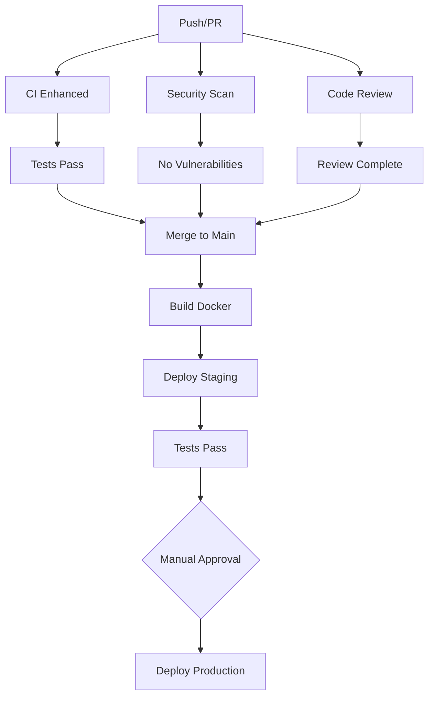

# GitHub Actions Workflows

This directory contains comprehensive CI/CD and automation workflows for the ArbFinder Suite.

## 📋 Overview

The workflows provide automated solutions for:
- **Code Quality & Linting** - Automated code review and style checks
- **Testing** - Unit, integration, and security testing
- **Security** - Vulnerability scanning and penetration testing
- **Documentation** - Auto-generation and quality checks
- **Deployment** - Staging and production deployments
- **Dependency Management** - Automated updates and vulnerability checks

## 🚀 Workflows

### 1. Enhanced CI/CD Pipeline (`ci-enhanced.yml`)

**Triggers:** Push to main/develop, Pull requests

**Jobs:**
- **Lint Python/Frontend** - Code style and quality checks
- **Test Python** - Matrix testing across Python 3.9-3.12
- **Test Analysis CLI** - Comprehensive CLI testing
- **Test Frontend** - Build and test Next.js frontend
- **Security Scans** - Python (Safety, Bandit) and NPM audits
- **Database Validation** - PostgreSQL schema validation
- **Docker Build** - Multi-platform container builds
- **Documentation Check** - Markdown link and format validation

**Key Features:**
- Parallel job execution for speed
- Code coverage with Codecov integration
- Artifact uploads for reports
- Matrix testing across Python versions
- Docker buildx with caching

**Usage:**
```bash
# Runs automatically on push/PR
# Manual trigger:
gh workflow run ci-enhanced.yml
```

### 2. Security Vulnerability Scanning (`security-scan.yml`)

**Triggers:** Push, PR, Daily schedule (2 AM UTC), Manual

**Jobs:**
- **CodeQL Analysis** - GitHub's semantic code analysis
- **Dependency Review** - PR dependency security checks
- **Snyk Scan** - Third-party vulnerability scanning
- **Python Security** - Safety, Bandit, pip-audit, Semgrep
- **SAST** - Static application security testing
- **Secret Scanning** - TruffleHog and GitLeaks
- **Container Scan** - Trivy and Grype for Docker images
- **SQL Security** - SQL injection and syntax validation
- **License Compliance** - Check for problematic licenses

**Key Features:**
- Daily automated scans
- SARIF upload to GitHub Security tab
- Critical vulnerability alerting
- Multi-tool approach for comprehensive coverage

**Usage:**
```bash
# Runs daily automatically
# Manual trigger:
gh workflow run security-scan.yml
```

### 3. Code Review Automation (`code-review.yml`)

**Triggers:** Pull request events

**Jobs:**
- **Automated Review** - Complexity, dead code, duplication analysis
- **PR Size Check** - Automatic labeling based on PR size
- **Coverage Check** - Code coverage threshold validation
- **Breaking Changes** - Detect API breaking changes
- **Documentation Check** - Flag PRs needing doc updates
- **Auto-assign** - Assign reviewers based on changed files

**Key Features:**
- Automatic PR labeling (size/XS to size/XL)
- Coverage reporting on PR
- Breaking change detection
- Large PR warnings
- Smart reviewer assignment

**Usage:**
```bash
# Runs automatically on PR events
# Creates comments and labels
```

### 4. Documentation Automation (`documentation.yml`)

**Triggers:** Push to docs/code, PR, Manual

**Jobs:**
- **Generate API Docs** - Auto-generate from docstrings
- **Check Docs Quality** - Markdown linting, link checking, spell check
- **Generate Changelog** - Auto-update changelog from commits
- **Update Badges** - README badge management
- **Deploy Docs** - GitHub Pages deployment with MkDocs
- **Generate Examples** - Extract code examples from docs

**Key Features:**
- Automatic API documentation with pdoc3
- Documentation coverage metrics
- MkDocs with Material theme
- GitHub Pages deployment
- Spell checking with cspell

**Usage:**
```bash
# Runs on doc changes
# Manual trigger:
gh workflow run documentation.yml
```

### 5. Deployment Pipeline (`deployment.yml`)

**Triggers:** Git tags (v*.*.*), Manual with environment selection

**Jobs:**
- **Build and Push** - Multi-arch Docker images to GitHub Container Registry
- **Deploy Staging** - Staging environment deployment
- **Deploy Production** - Production deployment with approval
- **Database Migration** - Run PostgreSQL migrations
- **Create Rollback** - Generate rollback plans
- **Post-deployment Tests** - Integration and load tests
- **Notify Deployment** - Status notifications

**Key Features:**
- Environment-based deployments
- Approval gates for production
- Automatic rollback plans
- Health checks and smoke tests
- Multi-platform Docker builds

**Usage:**
```bash
# Tag-based deployment:
git tag -a v1.0.0 -m "Release v1.0.0"
git push origin v1.0.0

# Manual deployment:
gh workflow run deployment.yml -f environment=staging
```

### 6. Dependency Management (`dependency-management.yml`)

**Triggers:** Weekly schedule (Monday 9 AM), Manual, PR with dependency changes

**Jobs:**
- **Check Outdated** - Python and NPM dependency updates
- **Auto-update** - Automated dependency update PRs
- **Check Vulnerabilities** - Safety and npm audit
- **License Compliance** - Verify license compatibility
- **Renovate Config** - Validate Renovate bot configuration

**Key Features:**
- Weekly automated dependency checks
- Auto-create PRs for updates
- Vulnerability issue creation
- License compliance reporting
- Integration with Renovate bot

**Usage:**
```bash
# Runs weekly automatically
# Manual trigger:
gh workflow run dependency-management.yml
```

## 🔧 Configuration Files

### `.github/markdown-link-check-config.json`
Configures link checking behavior:
- Ignored patterns (localhost, examples)
- Timeout and retry settings
- Valid status codes

### `.github/cspell.json`
Spell checking configuration:
- Project-specific dictionary
- Ignored paths
- Technical terms

### `.markdownlint.json`
Markdown linting rules:
- Line length exceptions
- HTML in markdown allowed
- Consistent heading levels

### `renovate.json`
Renovate bot configuration:
- Auto-merge rules for minor/patch
- Security update handling
- Grouped dependency updates
- Schedule configuration

## 📊 Workflow Status Badges

Add these to your README:

```markdown


```

## 🔐 Required Secrets

Configure these in repository settings:

### Required for all workflows:
- `GITHUB_TOKEN` - Automatically provided

### Optional (for enhanced features):
- `SNYK_TOKEN` - Snyk vulnerability scanning
- `CODECOV_TOKEN` - Code coverage reporting
- `DATABASE_URL` - Production database connection
- `SLACK_WEBHOOK` - Slack notifications
- `DISCORD_WEBHOOK` - Discord notifications

## 🎯 Best Practices

### For Developers:

1. **Before Pushing:**
   - Run `pre-commit run --all-files`
   - Ensure tests pass locally
   - Update documentation if needed

2. **Pull Requests:**
   - Keep PRs small and focused
   - Wait for CI checks to pass
   - Address code review feedback
   - Update tests for new features

3. **Security:**
   - Never commit secrets
   - Review security scan results
   - Update vulnerable dependencies promptly

### For Maintainers:

1. **Review automated PRs:**
   - Dependency updates from Renovate
   - Security patches
   - Documentation updates

2. **Monitor workflow runs:**
   - Check for failed jobs
   - Review security reports
   - Act on critical issues

3. **Release process:**
   - Tag releases semantically (v1.2.3)
   - Review deployment results
   - Verify health checks pass

## 🔄 Workflow Dependencies



## 🐛 Troubleshooting

### Workflow failing?

1. **Check logs:**
   ```bash
   gh run list --workflow=ci-enhanced.yml
   gh run view <run-id> --log-failed
   ```

2. **Common issues:**
   - Dependency conflicts: Check `requirements.txt`
   - Test failures: Review test output
   - Security issues: Check scan reports
   - Docker build: Verify Dockerfile

3. **Rerun failed jobs:**
   ```bash
   gh run rerun <run-id> --failed
   ```

### Need to skip CI?

Add `[skip ci]` or `[ci skip]` to commit message:
```bash
git commit -m "docs: update README [skip ci]"
```

### Workflow permissions errors?

Check repository settings:
- Settings → Actions → General
- Workflow permissions: Read and write

## 📞 Support

- **Issues:** Create an issue with `ci/cd` label
- **Discussions:** GitHub Discussions
- **Documentation:** See individual workflow files

## 🔄 Updates

This automation suite is regularly updated. Check the workflows for:
- Latest tool versions
- New security checks
- Enhanced automation

**Last Updated:** 2024-11-04
